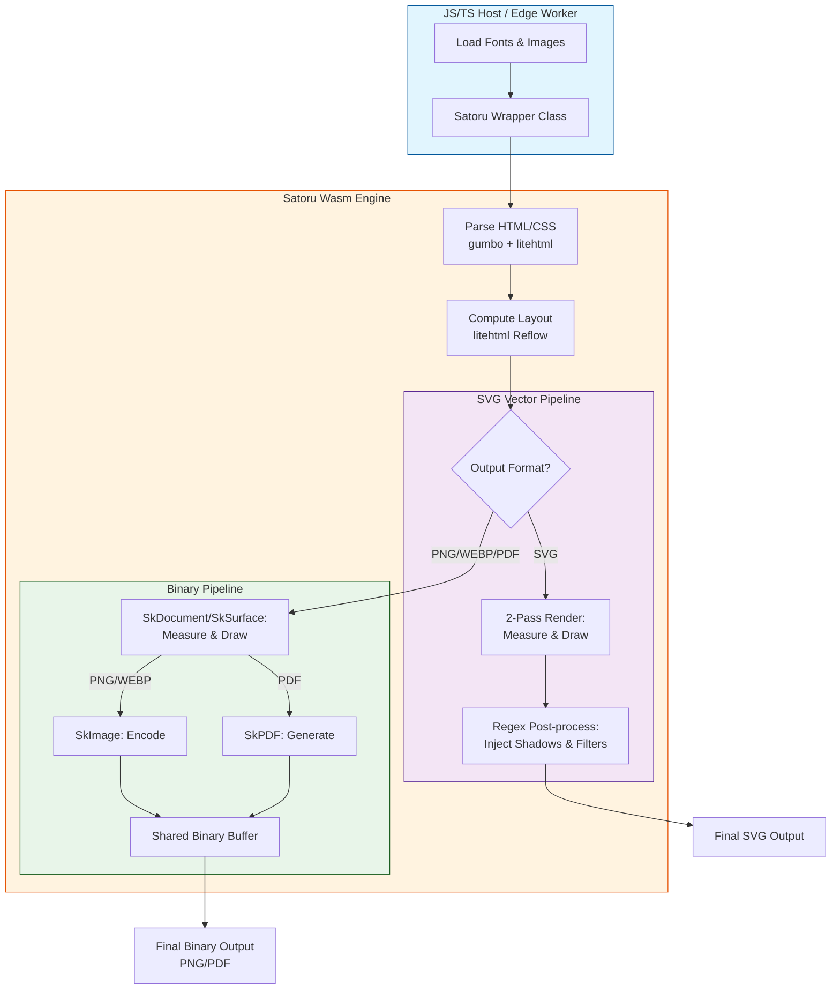

# Satoru Wasm: High-Performance HTML to SVG/PNG/PDF Engine

[](https://sorakumo001.github.io/satoru/)

**Satoru** is a portable, WebAssembly-powered HTML rendering engine. It combines the **Skia Graphics Engine** and **litehtml** to provide high-quality, pixel-perfect SVG, PNG, and PDF generation entirely within WebAssembly.

---

## 📊 Satoru vs Satori

| Feature            | Satori (Vercel)                    | **Satoru**                                          |
| ------------------ | ---------------------------------- | --------------------------------------------------- |
| **Engine**         | Yoga (Flexbox only)                | **litehtml (Full CSS Layout)**                      |
| **Renderer**       | Custom SVG Generator               | **Skia Graphics Engine**                            |
| **Output Formats** | SVG                                | **SVG, PNG, WEBP, PDF**                             |
| **CSS Support**    | Limited subset (Flexbox)           | **Extensive (Floats, Box-shadow, etc.)**            |
| **Images**         | External URLs, Base64, ArrayBuffer | **Embedded/Local/Url (PNG, JPEG, WebP, AVIF, GIF)** |
| **Font Formats**   | TTF, OTF, WOFF                     | **TTF, OTF, WOFF2, TTC**                            |
| **Typography**     | SVG Paths / Fonts                  | **Full Skia Typeface support**                      |
| **Performance**    | High (Lightweight)                 | **High (Wasm-accelerated Skia)**                    |
| **Edge Ready**     | Yes (Node/Edge/Cloudflare)         | **Yes (Wasm/Edge/Cloudflare)**                      |

---

## 🔄 Conversion Flow

The following diagram illustrates how Satoru processes HTML/CSS into vector or raster outputs:



---

## 🚀 Key Capabilities

### Core Engine

- **Pure Wasm Pipeline**: Performs all layout and drawing operations inside Wasm. Zero dependencies on browser DOM or `<canvas>`.
- **Edge Native**: Optimized for **Cloudflare Workers (workerd)**, ensuring smooth execution in restricted environments.
- **Triple Output Modes**:
  - **SVG**: Lean, vector-based SVG strings with post-processed filters/gradients. Includes **Glyph Path Optimization** using `<defs>` and `<use>` to minimize file size when converting text to paths.
  - **Raster (PNG/WebP)**: High-quality images via Skia with hardware-accelerated encoding.
  - **PDF**: Vector documents via Skia's PDF backend, including **multi-page output**.
- **State Persistence**: Supports a **Layout-Once, Render-Anywhere** pattern. Serialize layout state to binary and restore it later to skip reflow.

### Typography & Resources

- **Modular Text Stack**: A structured text processing pipeline consisting of `UnicodeService` (encapsulation of utf8proc/libunibreak), `TextLayout` (measurement & shaping), and `TextRenderer` (Skia drawing & decorations).
- **International Text Support**: Robust BiDi handling, script detection, and line-breaking (UAX #14) for CJK and mixed-script text.
- **Performance-Optimized Typography**: Implements a **Shaping Cache** that stores HarfBuzz results and `SkTextBlob` objects, significantly reducing CPU overhead for recurring text/font combinations.
- **Dynamic Font Loading**: Runtime loading of `.ttf`, `.woff2`, and `.ttc` with automatic style inference.
- **Image Format Support**: Native support for PNG, JPEG, WebP, AVIF, GIF, BMP, and ICO.

### Advanced CSS Support

- **Modern Color**: `oklch()`, `color-mix()`, and relative color syntax.
- **Layout**: `aspect-ratio`, Flexbox, Grid Layout (Basic), and **Container Queries**.
- **Effects**: Box-shadow (Outer/Inset), Text-shadow, Gradients (Linear/Radial/Conic), and CSS Filters (Blur, Drop-shadow).
- **Transforms**: Full support for `translate`, `rotate`, `scale`, `skew`, and `matrix` with correct stacking context.

---

## 📋 Supported CSS Properties

<details>
<summary>Click to expand supported properties list</summary>

### Box Model & Layout

- `display`, `position`, `float`, `clear`, `visibility`, `z-index`, `overflow`, `box-sizing`, `aspect-ratio`
- `width`, `height`, `min-width`, `min-height`, `max-width`, `max-height`
- `margin`, `padding`

### Typography & Text

- `color`, `font-family`, `font-size`, `font-weight`, `font-style`, `line-height`
- `text-align`, `vertical-align`, `text-decoration`, `text-transform`, `text-indent`, `text-overflow`, `white-space`
- `text-shadow`, `line-clamp`

### Backgrounds, Borders & Shadows

- `background-color`, `background-image`, `background-position`, `background-size`, `background-repeat`
- `border`, `border-width`, `border-style`, `border-color`, `border-radius`
- `box-shadow` (Outer & Inset)

### Flexbox & Grid

- `display: flex`, `flex-direction`, `flex-wrap`, `justify-content`, `align-items`, `gap`
- `display: grid`, `grid-template-columns`, `grid-template-rows`, `grid-column`, `grid-row`

### Others

- `container-type`, `container-name` (Container Queries)
- `content`, `appearance`

</details>

---

## 🛠️ Usage (TypeScript)

### 1. Standard Environment (Node.js / Browser)

Satoru provides a high-level `render` function that handles WASM instantiation and resource resolution.

```typescript
import { render, LogLevel } from "satoru";

const html = `
  <style>
    @font-face {
      font-family: 'Roboto';
      src: url('https://fonts.gstatic.com/s/roboto/v30/KFOmCnqEu92Fr1Mu4mxK.woff2');
    }
  </style>
  <div style="font-family: 'Roboto'; color: #2196F3; font-size: 40px;">
    Hello Satoru!
  </div>
`;

const png = await render({
  value: html,
  width: 600,
  format: "png",
  resolveResource: async (r) => {
    const res = await fetch(r.url);
    return res.ok ? new Uint8Array(await res.arrayBuffer()) : null;
  },
});
```

### 2. Cloudflare Workers (Edge)

Use the `workerd` specific export for restricted environments.

```typescript
import { render } from "satoru/workerd";
// ... use as normal
```

### 3. Multi-threaded Rendering

Distribute rendering tasks across multiple threads for high-throughput apps.

```typescript
import { createSatoruWorker } from "satoru";
const satoru = createSatoruWorker({ maxParallel: 4 });
const png = await satoru.render({ ...options });
```

### 4. Single-file (Embedded WASM)

Includes the WASM binary embedded in the JS bundle.

```typescript
import { render } from "satoru/single";
```

### 5. React Integration

```typescript
import { render } from "satoru";
import { toHtml } from "satoru/react";
const html = toHtml(<div style={{ color: "red" }}>React Component</div>);
const png = await render({ value: html, width: 600, format: "png" });
```

---

## 💻 CLI Usage

```bash
# Convert HTML file to PNG
npx satoru input.html -o output.png -w 1024

# Convert URL to PDF
npx satoru https://example.com -o example.pdf -f pdf
```

---

## 🏗️ Development

### Local Build

```bash
pnpm install
pnpm wasm:configure
pnpm wasm:build
pnpm build
```

### Testing

```bash
# Run visual regression tests
pnpm --filter visual-test test
```

---

## 🗺️ Roadmap

- [x] **Professional Text Shaping (HarfBuzz)**
- [x] **International Text & Line Breaking**
- [x] **CSS Container Queries**
- [x] **State Persistence (Serialization)**
- [x] **Structured Logging (spdlog)**
- [ ] **WASM Binary Optimization**
- [ ] **Backdrop Filter support**
- [ ] **Text Rendering Optimizations**
  - [x] **Text Shaping Cache**: Cache HarfBuzz results for recurring text/font combinations.
  - [x] **`SkTextBlob` Optimization**: Reuse and batch `SkTextBlob` objects for efficient Skia rendering.
  - [x] **Font Preloading & Persistence**: Minimize instantiation overhead by keeping `SkTypeface` in memory across rendering instances using a global cache (URL and data hash based).
  - [ ] **Parallel Layout Engine**: Enhance multi-threaded layout capabilities using Web Workers.
  - [x] **SVG Glyph Reuse**: Optimize SVG output using `<defs>` and `<use>` for text paths.
  - [ ] **Line Breaking Optimization**: Cache and reuse `libunibreak` analysis results.
  - [ ] **Smart Dirty Checking**: Avoid unnecessary re-renders for unchanged text/layout state.

---

## 📜 License

MIT License - SoraKumo <info@croud.jp>
