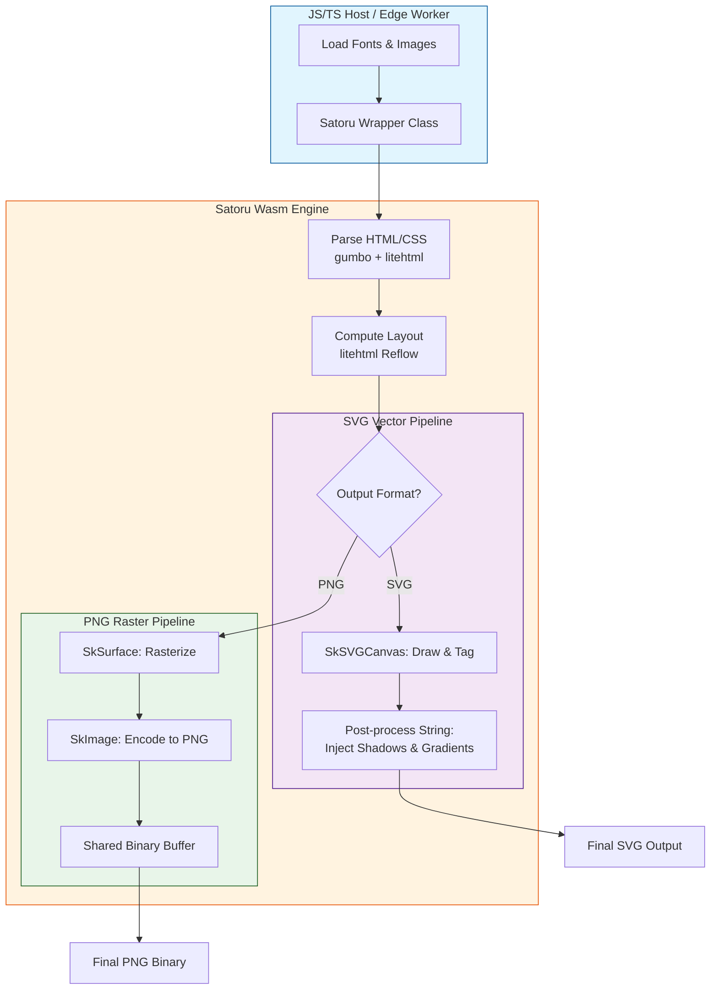

# Satoru Wasm: High-Performance HTML to SVG/PNG Engine

https://sorakumo001.github.io/satoru/

**Satoru** is a portable, WebAssembly-powered HTML rendering engine. It combines the **Skia Graphics Engine** and **litehtml** to provide high-quality, pixel-perfect SVG and PNG generation entirely within WebAssembly.

## 🚀 Project Status: High-Fidelity Rendering & Edge Ready

The engine supports full text layout with custom fonts, complex CSS styling, and efficient binary data transfer. It is now compatible with **Cloudflare Workers (workerd)**, allowing for serverless, edge-side image generation.

### Key Capabilities

- **Pure Wasm Pipeline**: Performs all layout and drawing operations inside Wasm. Zero dependencies on browser DOM or `<canvas>`.
- **Edge Native**: Specialized wrapper for Cloudflare Workers ensures smooth execution in restricted environments.
- **Dual Output Modes**:
  - **SVG**: Generates lean, vector-based SVG strings with post-processed effects.
  - **PNG**: Generates high-quality raster images via Skia, transferred as binary data for maximum performance.
- **High-Level TS Wrapper**: Includes a `Satoru` class that abstracts Wasm memory management and provides a clean async API.
- **Dynamic Font Loading**: Supports loading `.ttf` / `.woff2` / `.ttc` files at runtime.
- **Japanese Support**: Full support for Japanese rendering with fallback font logic.
- **Advanced CSS Support**:
  - **Box Model**: Margin, padding, border, and accurate **Border Radius**.
  - **Box Shadow**: High-quality shadows using SVG filters (SVG) or Skia blurs (PNG).
  - **Gradients**: Linear, Radial, and **Conic** (Sweep) gradient support.
  - **Text Decoration**: Supports `underline`, `line-through`, `overline` with `solid`, `dotted`, and `dashed` styles.

## 🔄 Conversion Flow

The following diagram illustrates how Satoru processes HTML/CSS into vector or raster outputs:



## 🛠 Usage (TypeScript)

### Standard Environment (Node.js / Browser)

```typescript
import { Satoru } from "satoru";

const satoru = new Satoru();
await satoru.init();

// Load a font
const fontData = await fetch("font.ttf").then((res) => res.arrayBuffer());
satoru.loadFont("MyFont", new Uint8Array(fontData));

// Convert HTML to PNG (Binary)
const pngBuffer = satoru.toPngBinary('<div style="...">...</div>', 800);
```

### Cloudflare Workers (Edge)

```typescript
import { Satoru } from "satoru/workerd";

// In your fetch handler
const satoru = new Satoru();
await satoru.init(); // Uses specialized workerd instantiation logic
```

## 🏗 Project Structure

This project is organized as a monorepo using pnpm workspaces:

- **`assets/`**: Shared HTML test cases and sample assets.
- **`packages/satoru` (`satoru`)**: The core library. Contains the WebAssembly engine and the TypeScript wrapper.
- **`packages/test-web` (`@satoru/test-web`)**: Vite-based demonstration UI.
- **`packages/test-cloudflare` (`satoru-sample`)**: Cloudflare Workers integration example. Provides a GET parameter-based rendering service.
- **`src/cpp`**: Shared C++ source code for the Wasm engine.

## 🏗️ Build & Run

### Prerequisites

- [emsdk](https://github.com/emscripten-core/emsdk)
- [vcpkg](https://vcpkg.io/) (Wasm32-emscripten triplet)
- Node.js & pnpm

### Commands

```bash
# 1. Install dependencies
pnpm install

# 2. Configure & Build WASM
pnpm wasm:configure
pnpm wasm:build

# 3. Build TS packages
pnpm build

# 4. Start Development UI
pnpm dev

# 5. Start Edge Worker (Cloudflare) Demo
pnpm dev:worker
```

## 🗺️ Roadmap

- [x] High-level TypeScript Wrapper API.
- [x] Binary PNG export support.
- [x] Linear, Radial & Conic Gradient support.
- [x] Border Radius & Box Shadow.
- [x] Japanese Language Rendering.
- [x] **Cloudflare Workers (workerd) support.**
- [ ] SVG Path Shorthand Optimization.
- [ ] Support for CSS Masks & Filters.
- [ ] Optional SVG `<text>` element output.

## 📜 License

MIT License - SoraKumo <info@croud.jp>
