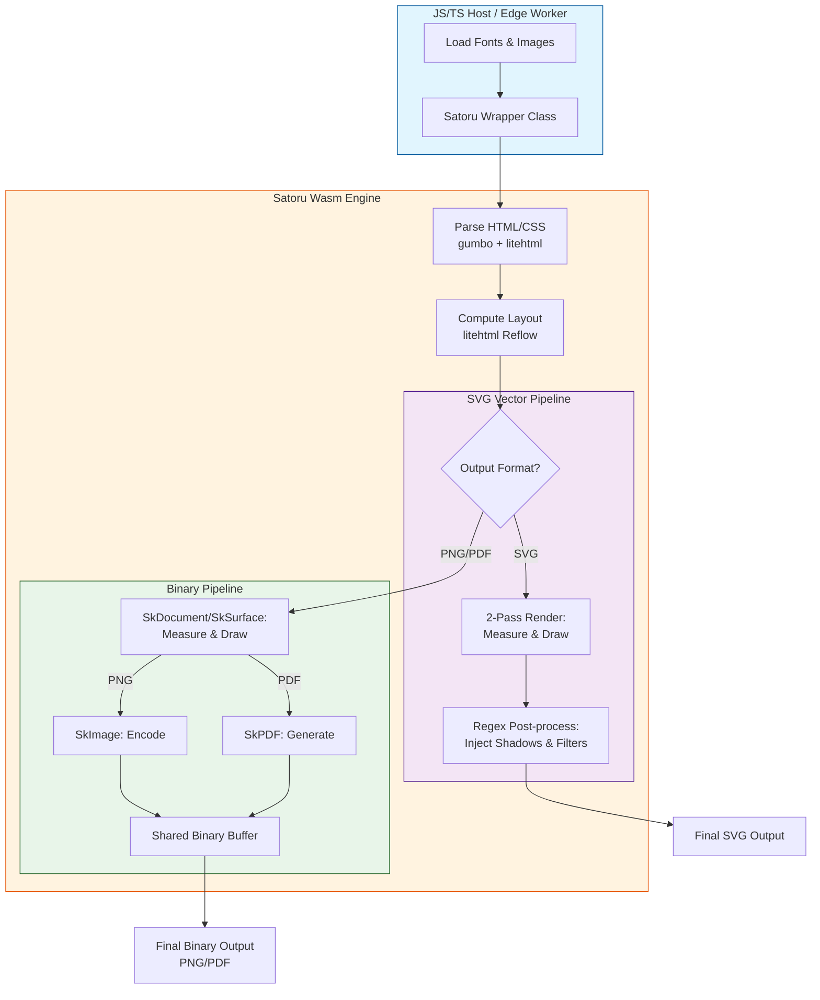

# Satoru Wasm: High-Performance HTML to SVG/PNG/PDF Engine

## Playground

https://sorakumo001.github.io/satoru/

**Satoru** is a portable, WebAssembly-powered HTML rendering engine. It combines the **Skia Graphics Engine** and **litehtml** to provide high-quality, pixel-perfect SVG, PNG, and PDF generation entirely within WebAssembly.

## 📊 Satoru vs Satori

| Feature            | Satori (Vercel)                    | **Satoru**                                     |
| ------------------ | ---------------------------------- | ---------------------------------------------- |
| **Engine**         | Yoga (Flexbox only)                | **litehtml (Full CSS Layout)**                 |
| **Renderer**       | Custom SVG Generator               | **Skia Graphics Engine**                       |
| **Output Formats** | SVG                                | **SVG, PNG, PDF**                              |
| **CSS Support**    | Limited subset (Flexbox)           | **Extensive (Floats, Box-shadow, etc.)**       |
| **Images**         | External URLs, Base64, ArrayBuffer | **Embedded/Local/Url (PNG, JPEG, WebP, AVIF)** |
| **Font Formats**   | TTF, OTF, WOFF                     | **TTF, OTF, WOFF2, TTC**                       |
| **Typography**     | SVG Paths / Fonts                  | **Full Skia Typeface support**                 |
| **Performance**    | High (Lightweight)                 | **High (Wasm-accelerated Skia)**               |
| **Edge Ready**     | Yes (Node/Edge/Cloudflare)         | **Yes (Wasm/Edge/Cloudflare)**                 |

## 🚀 Project Status: High-Fidelity Rendering & Edge Ready

The engine supports full text layout with custom fonts, complex CSS styling, and efficient binary data transfer. It is now compatible with **Cloudflare Workers (workerd)**, allowing for serverless, edge-side image and document generation.

### Key Capabilities

- **Pure Wasm Pipeline**: Performs all layout and drawing operations inside Wasm. Zero dependencies on browser DOM or `<canvas>`.
- **Edge Native**: Specialized wrapper for Cloudflare Workers ensures smooth execution in restricted environments.
- **Triple Output Modes**:
  - **SVG**: Generates lean, vector-based Pure SVG strings with post-processed effects (Filters, Gradients).
  - **PNG**: Generates high-quality raster images via Skia, transferred as binary data for maximum performance.
  - **PDF**: Generates high-fidelity vector documents via Skia's PDF backend, including native support for text, gradients, and images.
- **High-Level TS Wrapper**: Includes a `Satoru` class that abstracts Wasm memory management and provides a clean async API.
- **Dynamic Font Loading**: Supports loading `.ttf` / `.woff2` / `.ttc` files at runtime with automatic weight/style inference.
- **Japanese Support**: Full support for Japanese rendering with multi-font fallback logic.
- **Image Format Support**: Native support for **PNG**, **JPEG**, **WebP**, **AVIF**, **BMP**, and **ICO** image formats.
- **Advanced CSS Support**:
  - **Box Model**: Margin, padding, border, and accurate **Border Radius**.
  - **Box Shadow**: High-quality **Outer** and **Inset** shadows using advanced SVG filters (SVG) or Skia blurs (PNG/PDF).
  - **Gradients**: Linear, **Elliptical Radial**, and **Conic** (Sweep) gradient support.
  - **Standard Tags**: Full support for `<b>`, `<strong>`, `<i>`, `<u>`, and `<h1>`-`<h6>` via integrated master CSS.
  - **Text Decoration**: Supports `underline`, `line-through`, `overline` with `solid`, `dotted`, and `dashed` styles.
  - **Text Shadow**: Multiple shadows with blur, offset, and color support (PNG/SVG/PDF).

## 📋 Supported CSS Properties

Satoru supports a wide range of CSS properties for high-fidelity layout and styling.

### Box Model & Layout

- `display`, `position`, `float`, `clear`, `visibility`, `z-index`, `overflow`, `box-sizing`
- `width`, `height`, `min-width`, `min-height`, `max-width`, `max-height`
- `margin` (top, right, bottom, left)
- `padding` (top, right, bottom, left)

### Typography & Text

- `color`, `font-family`, `font-size`, `font-weight`, `font-style`, `line-height`
- `text-align`, `vertical-align`, `text-decoration` (line, color, style, thickness)
- `text-transform`, `text-indent`, `text-overflow`, `white-space`
- `text-shadow`
- `line-clamp` / `-webkit-line-clamp`, `-webkit-box-orient`

### Backgrounds

- `background-color`
- `background-image` (Supports `url()`, `linear-gradient`, `radial-gradient`, `conic-gradient`)
- `background-position`, `background-size`, `background-repeat`, `background-attachment`

### Borders & Shadows

- `border`, `border-width`, `border-style`, `border-color` (top, right, bottom, left)
- `border-radius` (Full support for all corners)
- `border-collapse`, `border-spacing`
- `box-shadow` (High-quality **Outer** and **Inset** shadows)

### Flexbox

- `display: flex`, `display: inline-flex`
- `flex-direction`, `flex-wrap`, `flex-flow`
- `justify-content`, `align-items`, `align-content`, `align-self`
- `flex-grow`, `flex-shrink`, `flex-basis`, `flex`
- `row-gap`, `column-gap`, `gap`, `order`

### Others

- `caption-side`, `content`, `appearance`

## 🔄 Conversion Flow

The following diagram illustrates how Satoru processes HTML/CSS into vector or raster outputs:



## 🛠️ Usage (TypeScript)

### Standard Environment (Node.js / Browser)

The `Satoru` class provides a high-level API for rendering HTML. It is initialized via the static `init` method.

#### Basic Rendering (Automatic Resource Resolution)

The `render` method supports automated multi-pass resource resolution. It identifies missing fonts, images, and external CSS and requests them via the `resolveResource` callback.

```typescript
import { Satoru, LogLevel } from "satoru";

// Initialize the engine
const satoru = await Satoru.init();

const html = `
  <style>
    @font-face {
      font-family: 'Roboto';
      src: url('https://fonts.gstatic.com/s/roboto/v30/KFOmCnqEu92Fr1Mu4mxK.woff2');
    }
  </style>
  <div style="font-family: 'Roboto'; color: #2196F3; font-size: 40px;">
    Hello Satoru!
    
  </div>
`;

// Render to PDF with automatic resource resolution
const pdf = await satoru.render({
  html,
  width: 600,
  format: "pdf",
  baseUrl: "https://example.com/assets/", // Optional: resolve relative URLs
  logLevel: LogLevel.Info, // Enable logging for this call (default is LogLevel.None)
  resolveResource: async (resource) => {
    const res = await fetch(resource.url);
    return res.ok ? new Uint8Array(await res.arrayBuffer()) : null;
  },
});
```

### ☁️ Cloudflare Workers (Edge)

Satoru is optimized for Cloudflare Workers. Use the `workerd` specific export for proper WASM instantiation.

```typescript
import { Satoru } from "satoru/workerd";

export default {
  async fetch(request) {
    const satoru = await Satoru.init();

    const pdf = await satoru.render({
      html: "<h1>Edge Rendered</h1>",
      width: 800,
      format: "pdf",
      baseUrl: "https://example.com/",
    });

    return new Response(pdf, {
      headers: { "Content-Type": "application/pdf" },
    });
  },
};
```

### 📦 Single-file (Embedded WASM)

For environments where deploying a separate `.wasm` file is difficult, use the `single` export which includes the WASM binary embedded.

```typescript
import { Satoru } from "satoru/single";

const satoru = await Satoru.init();
const png = await satoru.render({
  html: "<div>Embedded WASM!</div>",
  width: 600,
  format: "png",
});
```

### 🧵 Multi-threaded Rendering (Worker Proxy)

For high-throughput applications, the Worker proxy distributes rendering tasks across multiple threads. You can configure all resources in a single `render` call for stateless operation.

```typescript
import { createSatoruWorker, LogLevel } from "satoru";

// Create a worker proxy with up to 4 parallel instances
const satoru = createSatoruWorker({ maxParallel: 4 });

// Render with full configuration in one go
const png = await satoru.render({
  html: "<h1>Parallel Rendering</h1>",
  width: 800,
  format: "png",
  baseUrl: "https://example.com/assets/",
  clear: true, // Start with a fresh state for this task
  logLevel: LogLevel.Debug, // Enable debug logs for this task
  fonts: [{ name: "CustomFont", data: fontData }], // Pre-load fonts
  css: "h1 { color: red; }", // Inject extra CSS
});
```

### 💣 React Integration

Satoru provides a utility to easily convert React elements to HTML strings for rendering.

```typescript
import { Satoru } from "satoru";
import { toHtml } from "satoru/react";
import React from "react";

const satoru = await Satoru.init();
const html = toHtml(
  <div style={{ color: "#2196F3", fontSize: "40px" }}>
    Hello from React!
  </div>
);

const png = await satoru.render({ html, width: 600, format: "png" });
```

### 🎨 Manual Resource Management

For scenarios where you want to manage resources manually:

```typescript
// Load a font globally
satoru.loadFont("MyFont", fontUint8Array);

// Load an image into the engine's cache
satoru.loadImage("logo-id", "https://example.com/logo.png", width, height);

// Clear caches
satoru.clearFonts();
satoru.clearImages();
satoru.clearCss();
```

## 🧪 Testing & Validation

The project includes a robust **Visual Regression Suite** to ensure rendering fidelity.

### Visual Regression Tests (`packages/visual-test`)

This suite compares Satoru's outputs against Chromium's rendering.

- **Triple Validation Pipeline**: Every test asset is verified through PNG, SVG, and PDF formats.
- **Numerical Precision**: PNG tests report exact pixel difference percentages.
- **Fast Execution**: Multi-threaded reference generation and batch conversion.

#### Run Tests

```bash
pnpm --filter visual-test test
```

#### Generate Reference Images

```bash
pnpm --filter visual-test gen-ref
```

#### Batch Convert Assets (Multithreaded)

```bash
pnpm --filter visual-test convert-assets
```

## 🏗️ Build & Run

### Local Environment

Requires Emscripten SDK and vcpkg.

```bash
pnpm install
pnpm wasm:configure
pnpm wasm:build
pnpm build
pnpm dev
```

### Docker Environment (Recommended)

Build Wasm artifacts inside a Docker container without local toolchains.

```bash
pnpm wasm:docker:build
pnpm build
```

## 🗺️ Roadmap

- [x] High-level TypeScript Wrapper API with automatic resource resolution.
- [x] Binary PNG export support via shared memory.
- [x] **High-fidelity PDF export support via Skia's PDF backend.**
- [x] Linear, Elliptical Radial & Conic Gradient support.
- [x] Border Radius & **Advanced Box Shadow (Outer/Inset)**.
- [x] Japanese Language Rendering & Standard HTML Tag Support.
- [x] **Cloudflare Workers (workerd) compatibility.**
- [x] **Text Shadow (Multiple shadows, Blur, Offset).**
- [x] **Improved Font Fallback & Generic Family Mapping.**
- [ ] SVG Path Shorthand Optimization.
- [ ] Support for CSS Masks & Filters.
- [ ] Optional SVG `<text>` element output (currently paths).

## 📜 License

MIT License - SoraKumo <info@croud.jp>
