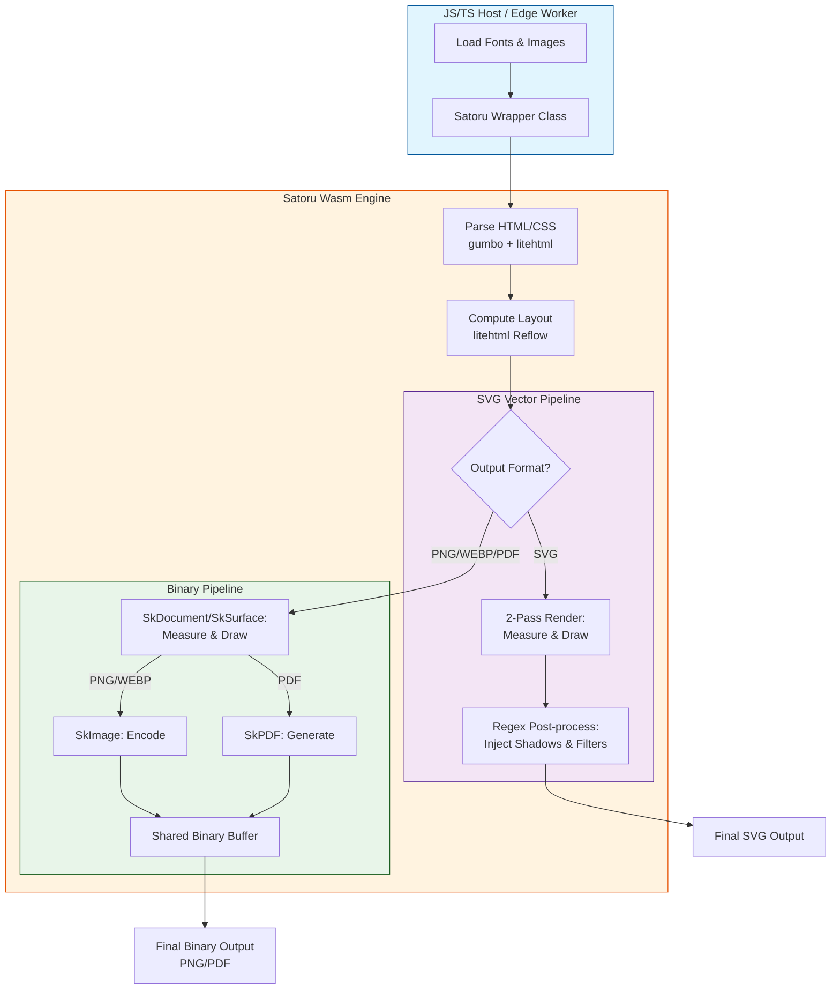

# Satoru Wasm: High-Performance HTML to SVG/PNG/PDF Engine

## Playground

https://sorakumo001.github.io/satoru/

**Satoru** is a portable, WebAssembly-powered HTML rendering engine. It combines the **Skia Graphics Engine** and **litehtml** to provide high-quality, pixel-perfect SVG, PNG, and PDF generation entirely within WebAssembly.

## 📊 Satoru vs Satori

| Feature            | Satori (Vercel)                    | **Satoru**                                          |
| ------------------ | ---------------------------------- | --------------------------------------------------- |
| **Engine**         | Yoga (Flexbox only)                | **litehtml (Full CSS Layout)**                      |
| **Renderer**       | Custom SVG Generator               | **Skia Graphics Engine**                            |
| **Output Formats** | SVG                                | **SVG, PNG, WEBP, PDF**                             |
| **CSS Support**    | Limited subset (Flexbox)           | **Extensive (Floats, Box-shadow, etc.)**            |
| **Images**         | External URLs, Base64, ArrayBuffer | **Embedded/Local/Url (PNG, JPEG, WebP, AVIF, GIF)** |
| **Font Formats**   | TTF, OTF, WOFF                     | **TTF, OTF, WOFF2, TTC**                            |
| **Typography**     | SVG Paths / Fonts                  | **Full Skia Typeface support**                      |
| **Performance**    | High (Lightweight)                 | **High (Wasm-accelerated Skia)**                    |
| **Edge Ready**     | Yes (Node/Edge/Cloudflare)         | **Yes (Wasm/Edge/Cloudflare)**                      |

## 🚀 Project Status: High-Fidelity Rendering & Edge Ready

The engine supports full text layout with custom fonts, complex CSS styling, and efficient binary data transfer. It is now compatible with **Cloudflare Workers (workerd)**, allowing for serverless, edge-side image and document generation.

### Key Capabilities

- **Pure Wasm Pipeline**: Performs all layout and drawing operations inside Wasm. Zero dependencies on browser DOM or `<canvas>`.
- **Edge Native**: Specialized wrapper for Cloudflare Workers ensures smooth execution in restricted environments.
- **Triple Output Modes**:
  - **SVG**: Generates lean, vector-based Pure SVG strings with post-processed effects (Filters, Gradients).
  - **PNG**: Generates high-quality raster images via Skia, transferred as binary data for maximum performance.
  - **WEBP**: Generates high-efficiency raster images via Skia, supporting both lossy and lossless compression.
  - **PDF**: Generates high-fidelity vector documents via Skia's PDF backend, including native support for text, gradients, images, and **multi-page output**.
- **High-Level TS Wrapper**: Includes a `Satoru` class that abstracts Wasm memory management and provides a clean async API.
- **Dynamic Font Loading**: Supports loading `.ttf` / `.woff2` / `.ttc` files at runtime with automatic weight/style inference.
- **No Default Fonts**: Satoru does not contain any built-in fonts. You must explicitly load fonts via `@font-face` or the `loadFont` API to render text.
- **International Text Support**: Robust line-breaking (UAX #14) and character-boundary handling for CJK and mixed-script text using `libunibreak` and `utf8proc`.
- **Japanese Support**: Full support for Japanese rendering with multi-font fallback logic.
- **Image Format Support**: Native support for **PNG**, **JPEG**, **WebP**, **AVIF**, **GIF**, **BMP**, and **ICO** image formats.
- **Advanced CSS Support**:
  - **Modern Color Spaces**: Support for `oklch()` color space and `color-mix()` function (sRGB/OKLab).
  - **Layout**: Support for `aspect-ratio` property (including `auto <ratio>` for replaced elements).
  - **Box Model**: Margin, padding, border, and accurate **Border Radius**.
  - **Box Shadow**: High-quality **Outer** and **Inset** shadows using advanced SVG filters (SVG) or Skia blurs (PNG/PDF).
  - **Gradients**: Linear, **Elliptical Radial**, and **Conic** (Sweep) gradient support.
  - **Standard Tags**: Full support for `<b>`, `<strong>`, `<i>`, `<u>`, and `<h1>`-`<h6>` via integrated master CSS.
  - **Text Decoration**: Supports `underline`, `line-through`, `overline` with `solid`, `dotted`, and `dashed` styles.
  - **Text Shadow**: Multiple shadows with blur, offset, and color support (PNG/SVG/PDF).
  - **Expressions**: Robust recursive `calc()` support for all CSS units and mixed-unit calculations.
  - **Filters**: CSS Filter support including `blur()` and `drop-shadow()` for both PNG and SVG outputs.
  - **Transforms**: Full support for `translate`, `rotate`, `scale`, `skew`, and `matrix` with correct stacking context handling.

## 📋 Supported CSS Properties

Satoru supports a wide range of CSS properties for high-fidelity layout and styling.

### Box Model & Layout

- `display`, `position`, `float`, `clear`, `visibility`, `z-index`, `overflow`, `box-sizing`, `aspect-ratio`
- `width`, `height`, `min-width`, `min-height`, `max-width`, `max-height`
- `margin` (top, right, bottom, left)
- `padding` (top, right, bottom, left)

### Typography & Text

- `color` (Supports `oklch()`, `color-mix()`), `font-family`, `font-size`, `font-weight`, `font-style`, `line-height`
- `text-align`, `vertical-align`, `text-decoration` (line, color, style, thickness)
- `text-transform`, `text-indent`, `text-overflow`, `white-space`
- `text-shadow`
- `line-clamp` / `-webkit-line-clamp`, `-webkit-box-orient`

### Backgrounds

- `background-color`
- `background-image` (Supports `url()`, `linear-gradient`, `radial-gradient`, `conic-gradient`)
- `background-position`, `background-size`, `background-repeat`, `background-attachment`

### Borders & Shadows

- `border`, `border-width`, `border-style`, `border-color` (top, right, bottom, left)
- `border-radius` (Full support for all corners)
- `border-collapse`, `border-spacing`
- `box-shadow` (High-quality **Outer** and **Inset** shadows)

### Flexbox

- `display: flex`, `display: inline-flex`
- `flex-direction`, `flex-wrap`, `flex-flow`
- `justify-content`, `align-items`, `align-content`, `align-self`
- `flex-grow`, `flex-shrink`, `flex-basis`, `flex`
- `row-gap`, `column-gap`, `gap`, `order`

### Grid Layout (Advanced)

- `display: grid`, `display: inline-grid`
- `grid-template-columns`, `grid-template-rows` (Supports `px`, `%`, `fr`, `auto`, and spanning)
- `grid-column-start`, `grid-column-end`, `grid-row-start`, `grid-row-end` (Full `span` support)
- `justify-content`, `align-content` (Supports `center`, `start`, `end`, `space-between`, `space-around`, `space-evenly`)
- `column-gap`, `row-gap`, `gap`

### Others

- `container-type`, `container-name`, `container` (Container Queries)
- `caption-side`, `content`, `appearance`

## 🔄 Conversion Flow

The following diagram illustrates how Satoru processes HTML/CSS into vector or raster outputs:



## 🛠️ Usage (TypeScript)

### Standard Environment (Node.js / Browser)

Satoru provides a high-level `render` function for converting HTML to various formats. It automatically handles WASM instantiation and resource resolution.

#### Basic Rendering (Automatic Resource Resolution)

The `render` function supports automated multi-pass resource resolution. It identifies missing fonts, images, and external CSS and requests them via the `resolveResource` callback.

```typescript
import { render, LogLevel } from "satoru";

const html = `
  <style>
    @font-face {
      font-family: 'Roboto';
      src: url('https://fonts.gstatic.com/s/roboto/v30/KFOmCnqEu92Fr1Mu4mxK.woff2');
    }
  </style>
  <div style="font-family: 'Roboto'; color: #2196F3; font-size: 40px;">
    Hello Satoru!
    
  </div>
`;

// Render to PDF with automatic resource resolution from HTML string
const pdf = await render({
  value: html,
  width: 600,
  format: "pdf",
  baseUrl: "https://example.com/assets/", // Optional: resolve relative URLs
  logLevel: LogLevel.Info,
  resolveResource: async (resource) => {
    const res = await fetch(resource.url);
    return res.ok ? new Uint8Array(await res.arrayBuffer()) : null;
  },
});

// Render from a URL directly
const png = await render({
  url: "https://example.com/page.html",
  width: 1024,
  format: "png",
});
```

````

#### Render Options

| Option            | Type                                | Description                                                              |
| ----------------- | ----------------------------------- | ------------------------------------------------------------------------ |
| `value`           | `string \| string[]`                | HTML string or array of HTML strings. (One of `value` or `url` is required) |
| `url`             | `string`                            | URL to fetch HTML from. (One of `value` or `url` is required)            |
| `width`           | `number`                            | **Required.** Width of the output in pixels.                             |
| `height`          | `number`                            | Height of the output in pixels. Default is `0` (automatic height).       |
| `format`          | `"svg" \| "png" \| "webp" \| "pdf"` | Output format. Default is `"svg"`.                                       |
| `textToPaths`     | `boolean`                           | Whether to convert SVG text to paths. Default is `true`.                 |
| `resolveResource` | `ResourceResolver`                  | Async callback to fetch missing fonts, images, or CSS.                   |
| `fonts`           | `Object[]`                          | Array of `{ name, data: Uint8Array }` to pre-load fonts.                 |
| `images`          | `Object[]`                          | Array of `{ name, url, width?, height? }` to pre-load images.            |
| `css`             | `string`                            | Extra CSS to inject into the rendering process.                          |
| `baseUrl`         | `string`                            | Base URL used to resolve relative URLs in fonts, images, and links.      |
| `userAgent`       | `string`                            | User-Agent header for fetching resources (Node.js environment).          |
| `logLevel`        | `LogLevel`                          | Logging verbosity (`None`, `Error`, `Warning`, `Info`, `Debug`).         |
| `onLog`           | `(level, msg) => void`              | Custom callback for receiving log messages.                              |

### ☁️ Cloudflare Workers (Edge)

Satoru is optimized for Cloudflare Workers. Use the `workerd` specific export which handles the specific WASM instantiation requirements of the environment.

```typescript
import { render } from "satoru/workerd";

export default {
  async fetch(request) {
    const pdf = await render({
      value: `
        <style>@font-face { font-family: 'Roboto'; src: url('https://fonts.gstatic.com/s/roboto/v30/KFOmCnqEu92Fr1Mu4mxK.woff2'); }</style>
        <h1 style="font-family: Roboto">Edge Rendered</h1>
      `,
      width: 800,
      format: "pdf",
      baseUrl: "https://example.com/",
    });

    return new Response(pdf, {
      headers: { "Content-Type": "application/pdf" },
    });
  },
};
````

### 📦 Single-file (Embedded WASM)

For environments where deploying a separate `.wasm` file is difficult, use the `single` export which includes the WASM binary embedded.

```typescript
import { render } from "satoru/single";

const png = await render({
  value: `
    <style>@font-face { font-family: 'Roboto'; src: url('https://fonts.gstatic.com/s/roboto/v30/KFOmCnqEu92Fr1Mu4mxK.woff2'); }</style>
    <div style="font-family: Roboto">Embedded WASM!</div>
  `,
  width: 600,
  format: "png",
});
```

### 🧵 Multi-threaded Rendering (Worker Proxy)

For high-throughput applications, the Worker proxy distributes rendering tasks across multiple threads. You can configure all resources in a single `render` call for stateless operation.

```typescript
import { createSatoruWorker, LogLevel } from "satoru";

// Create a worker proxy with up to 4 parallel instances
const satoru = createSatoruWorker({ maxParallel: 4 });

// Render with full configuration in one go
const png = await satoru.render({
  value: `
    <style>@font-face { font-family: 'Roboto'; src: url('https://fonts.gstatic.com/s/roboto/v30/KFOmCnqEu92Fr1Mu4mxK.woff2'); }</style>
    <div style="font-family: Roboto"><h1>Parallel Rendering</h1></div>
  `,
  width: 800,
  format: "png",
  baseUrl: "https://example.com/assets/",
  logLevel: LogLevel.Debug, // Enable debug logs for this task
  fonts: [{ name: "CustomFont", data: fontData }], // Pre-load fonts
  css: "h1 { color: red; }", // Inject extra CSS
});
```

### 💣 React Integration

Satoru provides a utility to easily convert React elements to HTML strings for rendering.

```typescript
import { render } from "satoru";
import { toHtml } from "satoru/react";
import React from "react";

const html = toHtml(
  <div style={{ fontFamily: 'Roboto', color: "#2196F3", fontSize: "40px" }}>
    <style>{`@font-face { font-family: 'Roboto'; src: url('https://fonts.gstatic.com/s/roboto/v30/KFOmCnqEu92Fr1Mu4mxK.woff2'); }`}</style>
    Hello from React!
  </div>
);

const png = await render({ value: html, width: 600, format: "png" });
```

### 💻 CLI Usage

Satoru includes a command-line interface for easy conversion.

```bash
# Convert a local HTML file to PNG
npx satoru input.html -o output.png

# Convert a URL to PDF
npx satoru https://example.com -o example.pdf -w 1280

# Convert with custom options
npx satoru input.html -w 1024 -f webp --verbose
```

#### CLI Options

- `<input>`: Input file path or URL (**Required**)
- `-o, --output <path>`: Output file path
- `-w, --width <number>`: Viewport width (default: 800)
- `-h, --height <number>`: Viewport height (default: 0, auto-calculate)
- `-f, --format <format>`: Output format: `svg`, `png`, `webp`, `pdf`
- `--verbose`: Enable detailed logging
- `--help`: Show help message

### 📄 Multi-page PDF Generation

You can generate a multi-page PDF by passing an array of HTML strings to the `value` property. Each string in the array will be rendered as a new page.

```typescript
import { render } from "satoru";

const pdf = await render({
  value: [
    `<style>@font-face { font-family: 'Roboto'; src: url('https://fonts.gstatic.com/s/roboto/v30/KFOmCnqEu92Fr1Mu4mxK.woff2'); }</style><div style="font-family: Roboto"><h1>Page 1</h1><p>First page content.</p></div>`,
    `<style>@font-face { font-family: 'Roboto'; src: url('https://fonts.gstatic.com/s/roboto/v30/KFOmCnqEu92Fr1Mu4mxK.woff2'); }</style><div style="font-family: Roboto"><h1>Page 2</h1><p>Second page content.</p></div>`,
    `<style>@font-face { font-family: 'Roboto'; src: url('https://fonts.gstatic.com/s/roboto/v30/KFOmCnqEu92Fr1Mu4mxK.woff2'); }</style><div style="font-family: Roboto"><h1>Page 3</h1><p>Third page content.</p></div>`,
  ],
  width: 600,
  format: "pdf",
});
```

### 🔄 State Persistence (Advanced)

For advanced use cases like serverless caching or reactive re-rendering, Satoru supports a **Layout-Once, Render-Anywhere** pattern inspired by JAX/Flax. You can serialize the calculated layout state into a lightweight binary format (`Float32Array`) and restore it later to skip the expensive layout calculation step.

```typescript
import { Satoru } from "satoru";
import satoruFactory from "satoru/wasm"; // Import the factory directly

const satoru = await Satoru.create(satoruFactory);

// 1. Initialize and Layout (Expensive Step)
const inst = await satoru.initDocument({
  html: `
    <style>
      @font-face {
        font-family: 'Roboto';
        src: url('https://fonts.gstatic.com/s/roboto/v30/KFOmCnqEu92Fr1Mu4mxK.woff2');
      }
    </style>
    <div style='font-family: Roboto; color: red'>Hello State!</div>
  `,
  width: 800,
});
await satoru.layoutDocument(inst, 800);

// 2. Serialize State (Lightweight Float32Array)
const layoutState = await satoru.serializeLayout(inst);
await satoru.destroyInstance(inst);

// ... Save `layoutState` to KV, Database, or File ...

// 3. Restore and Render (Fast Step)
// No layout calculation needed here!
const inst2 = await satoru.initDocument({
  html: `
    <style>
      @font-face {
        font-family: 'Roboto';
        src: url('https://fonts.gstatic.com/s/roboto/v30/KFOmCnqEu92Fr1Mu4mxK.woff2');
      }
    </style>
    <div style='font-family: Roboto; color: red'>Hello State!</div>
  `, // Must match original structure
  width: 800,
});
await satoru.deserializeLayout(inst2, layoutState!);

const png = await satoru.renderFromState(inst2, {
  width: 800,
  format: "png",
});

await satoru.destroyInstance(inst2);
```

## 🧪 Testing & Validation

The project includes a robust **Visual Regression Suite** to ensure rendering fidelity.

### Visual Regression Tests (`packages/visual-test`)

This suite compares Satoru's outputs against Chromium's rendering.

- **Triple Validation Pipeline**: Every test asset is verified through PNG, SVG, and PDF formats.
- **Numerical Precision**: PNG tests report exact pixel difference percentages.
- **Fast Execution**: Multi-threaded reference generation and batch conversion.

#### Run Tests

```bash
pnpm --filter visual-test test
```

#### Update Snapshots

If you have made intentional changes to the rendering engine, you can update the reference images and baseline metrics.

```bash
pnpm --filter visual-test test:update
```

#### Generate Reference Images

```bash
pnpm --filter visual-test gen-ref
```

#### Batch Convert Assets (Multithreaded)

```bash
pnpm --filter visual-test convert-assets [file.html] [--width <number>] [--no-outline] [--verbose]
```

- `file.html`: Optional. Convert a specific asset.
- `--width <number>`: Optional. Set output width (default: 800).
- `--no-outline`: Optional. Disable text outlining in SVG.
- `--verbose`: Optional. Show detailed logs.

## 🏗️ Build & Run

### Local Environment

Requires Emscripten SDK and vcpkg.

```bash
pnpm install
pnpm wasm:configure
pnpm build:all
pnpm dev:playground
```

### Docker Environment (Recommended for WASM)

Build WASM artifacts inside a Docker container without local toolchains.

```bash
pnpm wasm:docker:build
pnpm build:all
```

## 🗺️ Roadmap

### Core Engine & Layout

- [x] High-level TypeScript Wrapper API with automatic resource resolution.
- [x] **Engine State Persistence (Serialize/Deserialize Layout).**
- [x] Improved Font Fallback & Generic Family Mapping.
- [x] **International text processing (UAX #14 Line Breaking via libunibreak & utf8proc).**
- [x] **Advanced Table layout with `border-collapse` support.**
- [x] Multi-threaded rendering via Worker Proxy.
- [x] Support for CSS Logical Properties (margin-inline, padding-block, etc.).
- [x] Support for CSS Grid Layout (Basic template columns/rows).
- [x] **Mixed-unit `calc()` support (e.g., `100% - 20px`).**
- [x] Support for modern Media Query range syntax (e.g., `width >= 40rem`).
- [x] **CSS Container Queries (`@container`).**

### Rendering Features

- [x] Binary PNG & **WebP** export support.
- [x] **High-fidelity PDF export via Skia's PDF backend (Single & Multi-page).**
- [x] Linear, Elliptical Radial & Conic Gradient support.
- [x] Border Radius & **Advanced Box Shadow (Outer/Inset)**.
- [x] **Text Shadow (Multiple shadows, Blur, Offset).**
- [x] **Optional SVG `<text>` element output.**
- [x] Support for `oklch()` & `oklab()` color spaces.
- [x] Support for Relative Color Syntax (`oklch(from ...)`).
- [x] Support for `color-mix()` CSS function (OKLch/OKLab support).
- [x] Support for `light-dark()` color function.
- [x] Support for CSS Transforms (`translate`, `rotate`, `scale`, `skew`, `matrix`).
- [x] **Advanced CSS Filter support (`drop-shadow`, `blur`).**
- [ ] **Backdrop Filter support (`backdrop-filter`).**
- [ ] Masking support (`mask-image`).
- [ ] Wide Gamut Color support (`display-p3`) and Gamut Mapping.

### Platform & Integration

- [x] **Cloudflare Workers (workerd) compatibility.**
- [x] React Integration (JSX to HTML conversion).
- [x] Japanese Language Rendering & Standard HTML Tag Support.
- [x] **Command-line Interface (CLI) for batch conversion.**
- [x] Support for `aspect-ratio` property.
- [x] Support for `prefers-color-scheme` media feature.
- [ ] Partial support for modern feature detection stubs (`margin-trim`, `contain-intrinsic-size`, `hyphens`, etc.).

### Future Enhancements (Roadmap)

- [ ] **Professional Text Shaping (HarfBuzz)**: Integrate HarfBuzz via SkShaper to support complex scripts, ligatures, and RTL languages.
- [x] **Advanced Unicode Support**: Integrated `utf8proc` and `libunibreak` for proper Unicode normalization, grapheme clusters, and UAX #14 line breaking.
- [ ] **Robust Serialization**: Replace the custom binary serialization with a structured format like JSON (nlohmann/json) or Protocol Buffers for better maintainability and JS/TS integration.
- [ ] **Structured Logging & Formatting**: Adopt `spdlog` and `{fmt}` for high-performance, structured logging and cleaner C++ code.
- [ ] **WASM Binary Optimization**: Fine-tune library sub-setting to reduce the `.wasm` bundle size while adding more features.

## 📜 License

MIT License - SoraKumo <info@croud.jp>
