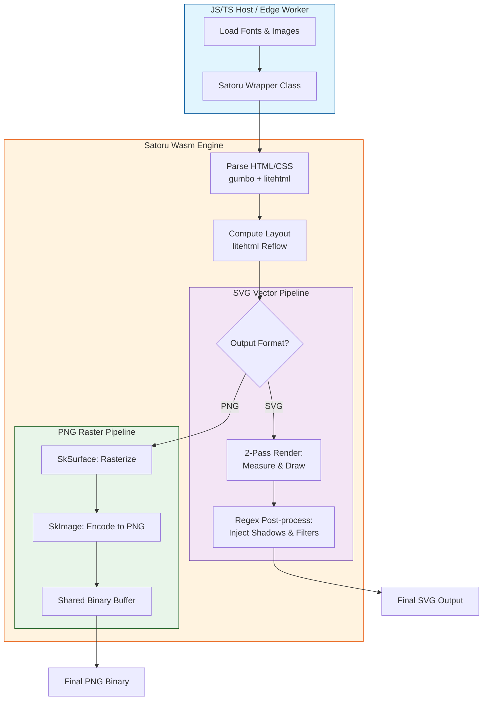

# Satoru Wasm: High-Performance HTML to SVG/PNG Engine

https://sorakumo001.github.io/satoru/

**Satoru** is a portable, WebAssembly-powered HTML rendering engine. It combines the **Skia Graphics Engine** and **litehtml** to provide high-quality, pixel-perfect SVG and PNG generation entirely within WebAssembly.

## 🚀 Project Status: High-Fidelity Rendering & Edge Ready

The engine supports full text layout with custom fonts, complex CSS styling, and efficient binary data transfer. It is now compatible with **Cloudflare Workers (workerd)**, allowing for serverless, edge-side image generation.

### Key Capabilities

- **Pure Wasm Pipeline**: Performs all layout and drawing operations inside Wasm. Zero dependencies on browser DOM or `<canvas>`.
- **Edge Native**: Specialized wrapper for Cloudflare Workers ensures smooth execution in restricted environments.
- **Dual Output Modes**:
  - **SVG**: Generates lean, vector-based Pure SVG strings with post-processed effects (Filters, Gradients).
  - **PNG**: Generates high-quality raster images via Skia, transferred as binary data for maximum performance.
- **High-Level TS Wrapper**: Includes a `Satoru` class that abstracts Wasm memory management and provides a clean async API.
- **Dynamic Font Loading**: Supports loading `.ttf` / `.woff2` / `.ttc` files at runtime with automatic weight/style inference.
- **Japanese Support**: Full support for Japanese rendering with fallback font logic and vertical alignment.
- **Image Format Support**: Native support for **PNG**, **JPEG**, **WebP**, **AVIF**, **BMP**, and **ICO** image formats.
- **Advanced CSS Support**:
  - **Box Model**: Margin, padding, border, and accurate **Border Radius**.
  - **Box Shadow**: High-quality **Outer** and **Inset** shadows using advanced SVG filters (SVG) or Skia blurs (PNG).
  - **Gradients**: Linear, **Elliptical Radial**, and **Conic** (Sweep) gradient support.
  - **Standard Tags**: Full support for `<b>`, `<strong>`, `<i>`, `<u>`, and `<h1>`-`<h6>` via integrated master CSS.
  - **Text Decoration**: Supports `underline`, `line-through`, `overline` with `solid`, `dotted`, and `dashed` styles.
  - **Text Shadow**: Multiple shadows with blur, offset, and color support (PNG/SVG).

## 📋 Supported CSS Properties

Satoru supports a wide range of CSS properties for high-fidelity layout and styling.

### Box Model & Layout
- `display`, `position`, `float`, `clear`, `visibility`, `z-index`, `overflow`, `box-sizing`
- `width`, `height`, `min-width`, `min-height`, `max-width`, `max-height`
- `margin` (top, right, bottom, left)
- `padding` (top, right, bottom, left)

### Typography & Text
- `color`, `font-family`, `font-size`, `font-weight`, `font-style`, `line-height`
- `text-align`, `vertical-align`, `text-decoration` (line, color, style, thickness)
- `text-transform`, `text-indent`, `text-overflow`, `white-space`
- `text-shadow`
- `line-clamp` / `-webkit-line-clamp`, `-webkit-box-orient`

### Backgrounds
- `background-color`
- `background-image` (Supports `url()`, `linear-gradient`, `radial-gradient`, `conic-gradient`)
- `background-position`, `background-size`, `background-repeat`, `background-attachment`

### Borders & Shadows
- `border`, `border-width`, `border-style`, `border-color` (top, right, bottom, left)
- `border-radius` (Full support for all corners)
- `border-collapse`, `border-spacing`
- `box-shadow` (High-quality **Outer** and **Inset** shadows)

### Flexbox
- `display: flex`, `display: inline-flex`
- `flex-direction`, `flex-wrap`, `flex-flow`
- `justify-content`, `align-items`, `align-content`, `align-self`
- `flex-grow`, `flex-shrink`, `flex-basis`, `flex`
- `row-gap`, `column-gap`, `gap`, `order`

### Others
- `caption-side`, `content`, `appearance`

## 🔄 Conversion Flow

The following diagram illustrates how Satoru processes HTML/CSS into vector or raster outputs:



## 🛠️ Usage (TypeScript)

### Standard Environment (Node.js / Browser)

The `Satoru` class provides a high-level API for rendering HTML. It is initialized via the static `init` method.

#### Basic Rendering (Automatic Resource Resolution)

The `render` method supports automated 2-pass resource resolution. It identifies missing fonts, images, and external CSS from the HTML and requests them via the `resolveResource` callback.

```typescript
import { Satoru } from "satoru";

// Initialize the engine
const satoru = await Satoru.init();

const html = `
  <style>
    @font-face {
      font-family: 'Roboto';
      src: url('https://fonts.gstatic.com/s/roboto/v30/KFOmCnqEu92Fr1Mu4mxK.woff2');
    }
  </style>
  <div style="font-family: 'Roboto'; color: #2196F3; font-size: 40px;">
    Hello Satoru!
    
  </div>
`;

// Render to SVG
// Satoru detects the required font and image, then fetches them via the callback
const svg = await satoru.render(html, 600, {
  resolveResource: async (resource) => {
    console.log(`Fetching ${resource.type}: ${resource.url}`);
    const res = await fetch(resource.url);
    if (!res.ok) return null;

    // Always return Uint8Array for all resource types (Font, Image, CSS)
    return new Uint8Array(await res.arrayBuffer());
  },
});
```

### ☁️ Cloudflare Workers (Edge)

Satoru is optimized for Cloudflare Workers. The `render` method's `resolveResource` callback works seamlessly with the standard `fetch` API on the edge.

```typescript
import { Satoru } from "satoru"; // Resolves to workerd-specific implementation

export default {
  async fetch(request) {
    const satoru = await Satoru.init();

    const html = `
      <style>
        @font-face {
          font-family: 'CustomFont';
          src: url('https://example.com/font.woff2');
        }
      </style>
      <div style='font-family: CustomFont'>Edge Rendered with Auto-loading</div>
    `;

    const svg = await satoru.render(html, 800, {
      resolveResource: async (resource) => {
        const res = await fetch(resource.url);
        return res.ok ? new Uint8Array(await res.arrayBuffer()) : null;
      },
    });

    return new Response(svg, {
      headers: { "Content-Type": "image/svg+xml" },
    });
  },
};
```

### 📦 Single-file (Embedded WASM)

For environments where deploying a separate `.wasm` file is difficult (e.g., some CI/CD pipelines or restricted Node.js environments), you can use the `single` export which includes the WASM binary embedded within the JS file.

```typescript
import { Satoru } from "satoru/single";

// Initialize the engine (no external .wasm file needed)
const satoru = await Satoru.init();
const svg = await satoru.render("<div>Embedded WASM!</div>", 600);
```

### 🎨 Manual Resource Management

For scenarios where you want to pre-load resources or manage them manually without the `render` callback:

```typescript
// Load a font globally
satoru.loadFont("MyFont", fontUint8Array);

// Load an image into the engine's cache
satoru.loadImage("logo-id", "https://example.com/logo.png", width, height);

// Clear caches
satoru.clearFonts();
satoru.clearImages();
```

## 🧪 Testing & Validation

The project includes a robust **Visual Regression Suite** to ensure rendering fidelity.

### Visual Regression Tests (`packages/test-visual`)

This suite compares Satoru's outputs against Chromium's rendering.

- **Dual Validation Pipeline**: Every test asset is verified through two paths:
  1. **Direct PNG**: Satoru's native Skia-based PNG output vs Chromium PNG.
  2. **SVG PNG**: Satoru's SVG output rendered in a browser vs Chromium PNG.
- **Numerical Precision**: Tests report the exact pixel difference percentage for both paths.
- **Fast Execution**:
  - **Reference Generation**: Multi-threaded using Playwright with shared contexts (~3s for 14 assets).
  - **Batch Conversion**: Multi-threaded using Node.js Worker Threads, running multiple Wasm instances in parallel (~1.8s for 14 assets).

#### Run Tests

```bash
pnpm --filter test-visual test
```

#### Generate Reference Images

```bash
pnpm --filter test-visual gen-ref
```

#### Batch Convert Assets (Multithreaded)

```bash
pnpm --filter test-visual convert-assets
```

## 🏗️ Build & Run

### Local Environment

Requires Emscripten SDK and vcpkg.

```bash
# 1. Install dependencies
pnpm install

# 2. Configure & Build WASM
pnpm wasm:configure
pnpm wasm:build

# 3. Build TS packages
pnpm build

# 4. Start Development UI
pnpm dev
```

### Docker Environment (Recommended)

Build Wasm artifacts inside a Docker container. No local C++ toolchain required.

```bash
# 1. Build Wasm via Docker
pnpm wasm:docker:build

# 2. Build TS packages
pnpm build
```

## 🗺️ Roadmap

- [x] High-level TypeScript Wrapper API with automatic resource resolution.
- [x] Binary PNG export support via shared memory.
- [x] Linear, Elliptical Radial & Conic Gradient support.
- [x] Border Radius & **Advanced Box Shadow (Outer/Inset)**.
- [x] Japanese Language Rendering & Standard HTML Tag Support.
- [x] **Cloudflare Workers (workerd) compatibility.**
- [x] **Text Shadow (Multiple shadows, Blur, Offset).**
- [ ] SVG Path Shorthand Optimization.
- [ ] Support for CSS Masks & Filters.
- [ ] Optional SVG `<text>` element output (currently paths).

## 📜 License

MIT License - SoraKumo <info@croud.jp>