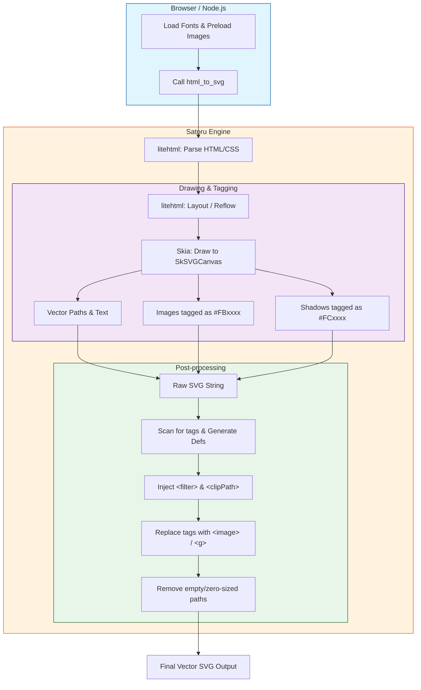

# Satoru Wasm: High-Performance HTML to SVG Engine

https://sorakumo001.github.io/satoru/

**Satoru** is a portable, WebAssembly-powered HTML rendering engine. It combines the **Skia Graphics Engine** and **litehtml** to provide high-quality, pixel-perfect SVG generation entirely within WebAssembly.

## 🚀 Project Status: High-Fidelity Rendering Ready

The engine supports full text layout with custom fonts, complex CSS styling, and efficient image embedding.

### Key Capabilities

- **Pure Wasm Pipeline**: Performs all layout and drawing operations inside Wasm. Zero dependencies on browser DOM or `<canvas>` for rendering.
- **Dynamic Font Loading**: Supports loading `.ttf` / `.woff2` / `.ttc` files at runtime. Text is rendered as vector paths in the resulting SVG.
- **Japanese Support**: Full support for Japanese rendering with fallback font logic (Noto Sans CJK, MS Gothic).
- **Advanced CSS Support**:
  - Box model (margin, padding, border).
  - **Border Radius**: Accurate rounded corners using SVG arc commands.
  - **Box Shadow**: High-quality shadows using SVG filters and Gaussian blur.
  - **Text Decoration**: Supports `underline`, `line-through`, `overline` with `solid`, `dotted`, and `dashed` styles. Lines remain continuous even over whitespace.
- **Efficient Image Handling**:
  - **Pre-loading Architecture**: The host environment (JS/TS) extracts and registers image Data URLs into the Wasm image cache *before* rendering starts.
  - **Host-side Decoding**: Image decoding is handled by the JavaScript environment, keeping the Wasm binary lean.
- **Wasm-to-Node Logging Bridge**: Real-time console output from Wasm `printf` is captured and formatted by the Node.js/TS runner.
- **Cross-Platform Build System**: A unified TypeScript-based build script (`scripts/build-wasm.ts`) handles configuration and compilation across Windows, macOS, and Linux.

## 🛠 Conversion Flow

The following diagram illustrates how Satoru converts HTML/CSS into a pure SVG string:



## 🛠 Tech Stack

- **Graphics**: [Skia](https://skia.org/) (Subset compiled from source for Wasm)
- **HTML Layout**: [litehtml](https://github.com/litehtml/litehtml)
- **HTML Parser**: [gumbo](https://github.com/google/gumbo-parser)
- **Font Backend**: [FreeType](https://www.freetype.org/)
- **Linker Logic**: Emscripten with SJLJ (Longjmp) and Exception support.

## 🏗 Build & Run

### Prerequisites

- [emsdk](https://github.com/emscripten-core/emsdk) (Targeting `latest`)
- [vcpkg](https://vcpkg.io/) (Wasm32-emscripten triplet)

#### Environment Variables

The build script requires the following environment variables:

- `EMSDK`: Path to your emscripten SDK directory.
- `VCPKG_ROOT`: Path to your vcpkg directory.

**Windows (PowerShell):**
```powershell
[System.Environment]::SetEnvironmentVariable('EMSDK', 'C:\emsdk', 'User')
[System.Environment]::SetEnvironmentVariable('VCPKG_ROOT', 'C:\vcpkg', 'User')
```

**macOS / Linux:**
```bash
export EMSDK=$HOME/emsdk
export VCPKG_ROOT=$HOME/vcpkg
```

**VS Code Setup (Local):**
Since `.vscode` is ignored by git, add this to your local `.vscode/settings.json`:
```json
{
    "terminal.integrated.env.windows": { "EMSDK": "C:/emsdk", "VCPKG_ROOT": "C:/vcpkg" },
    "terminal.integrated.env.osx": { "EMSDK": "${env:HOME}/emsdk", "VCPKG_ROOT": "${env:HOME}/vcpkg" }
}
```

### Commands

```bash
# Full clean rebuild (Deletes build folder and re-compiles everything)
npm run compile-wasm

# Incremental build (Fast C++ changes)
npm run cmake-build

# Run batch conversion test (Converts HTML assets to SVG with Logging)
npm test

# Start dev environment (Vite with side-by-side comparison UI)
npm run dev
```

## 🧩 Solved Challenges

- **Continuous Text Decoration**: Fixed the issue where underlines disappeared on space characters by allowing the layout engine to process whitespace-only runs for decoration drawing.
- **Wasm Logging**: Established a robust logging bridge by implementing `print` and `printErr` callbacks in the Emscripten module, enabling easier C++ debugging within Node.js.
- **Cross-Platform Pathing**: Migrated from shell-specific build commands to a Node.js-based build system, resolving inconsistencies between PowerShell and bash.
- **SVG Structure Stability**: Ensured `<defs>` are always injected inside the root `<svg>` tag even with complex embedded assets.

## 🗺 Roadmap

- [x] Dynamic Custom Font Support.
- [x] Border Radius & Advanced Box Styling.
- [x] Box Shadow support.
- [x] Text Decoration Styles (Dotted/Dashed).
- [x] Japanese Language Rendering.
- [x] Cross-platform build script.
- [x] Basic Linear, Radial & Conic Gradient support.
- [ ] SVG Path Shorthand Optimization (Minimize SVG size).
- [ ] Optional SVG `<text>` element output.
- [ ] Complex CSS Flexbox/Grid support - *In Progress (via litehtml)*.