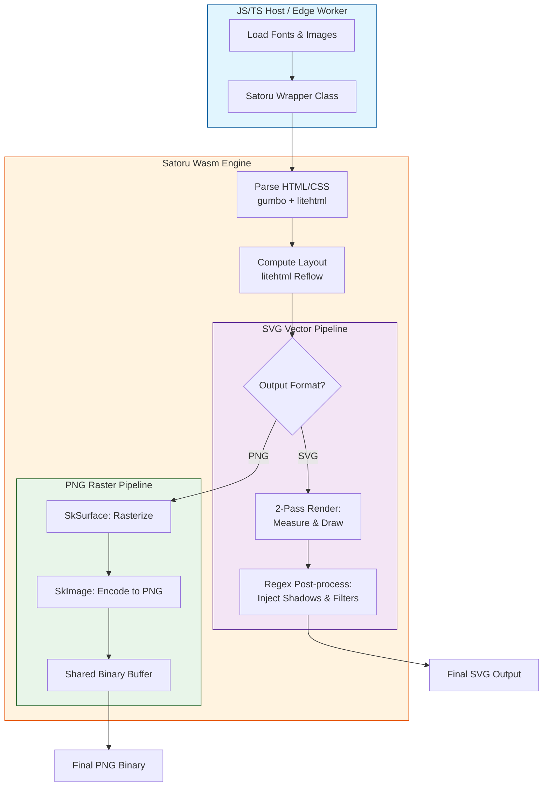

# Satoru Wasm: High-Performance HTML to SVG/PNG Engine

https://sorakumo001.github.io/satoru/

**Satoru** is a portable, WebAssembly-powered HTML rendering engine. It combines the **Skia Graphics Engine** and **litehtml** to provide high-quality, pixel-perfect SVG and PNG generation entirely within WebAssembly.

## 🚀 Project Status: High-Fidelity Rendering & Edge Ready

The engine supports full text layout with custom fonts, complex CSS styling, and efficient binary data transfer. It is now compatible with **Cloudflare Workers (workerd)**, allowing for serverless, edge-side image generation.

### Key Capabilities

- **Pure Wasm Pipeline**: Performs all layout and drawing operations inside Wasm. Zero dependencies on browser DOM or `<canvas>`.
- **Edge Native**: Specialized wrapper for Cloudflare Workers ensures smooth execution in restricted environments.
- **Dual Output Modes**:
  - **SVG**: Generates lean, vector-based Pure SVG strings with post-processed effects (Filters, Gradients).
  - **PNG**: Generates high-quality raster images via Skia, transferred as binary data for maximum performance.
- **High-Level TS Wrapper**: Includes a `Satoru` class that abstracts Wasm memory management and provides a clean async API.
- **Dynamic Font Loading**: Supports loading `.ttf` / `.woff2` / `.ttc` files at runtime with automatic weight/style inference.
- **Japanese Support**: Full support for Japanese rendering with fallback font logic and vertical alignment.
- **Advanced CSS Support**:
  - **Box Model**: Margin, padding, border, and accurate **Border Radius**.
  - **Box Shadow**: High-quality **Outer** and **Inset** shadows using advanced SVG filters (SVG) or Skia blurs (PNG).
  - **Gradients**: Linear, **Elliptical Radial**, and **Conic** (Sweep) gradient support.
  - **Standard Tags**: Full support for `<b>`, `<strong>`, `<i>`, `<u>`, and `<h1>`-`<h6>` via integrated master CSS.
  - **Text Decoration**: Supports `underline`, `line-through`, `overline` with `solid`, `dotted`, and `dashed` styles.

## 🔄 Conversion Flow

The following diagram illustrates how Satoru processes HTML/CSS into vector or raster outputs:



## 🛠️ Usage (TypeScript)

### Standard Environment (Node.js / Browser)

The `Satoru` class provides a high-level API for rendering HTML. It is initialized via the static `init` method.

#### Basic Rendering

The `render` method supports automated 2-pass resource resolution. It identifies missing fonts, images, and external CSS from the HTML and requests them via the `resolveResource` callback.

```typescript
import { Satoru } from "satoru";

// Initialize the engine
const satoru = await Satoru.init();

const html = `
  <div style="font-family: 'Roboto'; color: #2196F3; font-size: 40px;">
    Hello Satoru!
    
  </div>
`;

// Render to SVG (Default)
const svg = await satoru.render(html, 600, {
  resolveResource: async (resource) => {
    const res = await fetch(resource.url);
    if (!res.ok) return null;

    // Always return Uint8Array for all resource types (Font, Image, CSS)
    return new Uint8Array(await res.arrayBuffer());
  },
});

// Render to PNG (Binary)
const pngUint8Array = await satoru.render(html, 600, {
  format: "png",
  resolveResource: async (resource) => {
    /* ... */
  },
});
```

### ☁️ Cloudflare Workers (Edge)

Satoru is optimized for Cloudflare Workers. It handles the environment's specific Wasm instantiation constraints automatically when using the `workerd` export.

```typescript
import { Satoru } from "satoru"; // Resolves to workerd-specific implementation

export default {
  async fetch(request) {
    const satoru = await Satoru.init();

    // Manual font loading
    const fontRes = await fetch("https://example.com/font.woff2");
    const fontData = new Uint8Array(await fontRes.arrayBuffer());
    satoru.loadFont("CustomFont", fontData);

    const svg = await satoru.render(
      "<div style='font-family: CustomFont'>Edge Rendered</div>",
      800,
    );

    return new Response(svg, {
      headers: { "Content-Type": "image/svg+xml" },
    });
  },
};
```

### 🎨 Manual Resource Management

For scenarios where you want to pre-load resources or manage them manually without the `render` callback:

```typescript
// Load a font globally
satoru.loadFont("MyFont", fontUint8Array);

// Load an image into the engine's cache
satoru.loadImage("logo-id", "https://example.com/logo.png", width, height);

// Clear caches
satoru.clearFonts();
satoru.clearImages();
```

## 🧪 Testing & Validation

The project includes a robust **Visual Regression Suite** to ensure rendering fidelity.

### Visual Regression Tests (`packages/test-visual`)

This suite compares Satoru's outputs against Chromium's rendering.

- **Dual Validation Pipeline**: Every test asset is verified through two paths:
  1. **Direct PNG**: Satoru's native Skia-based PNG output vs Chromium PNG.
  2. **SVG PNG**: Satoru's SVG output rendered in a browser vs Chromium PNG.
- **Numerical Precision**: Tests report the exact pixel difference percentage for both paths.
- **Fast Execution**:
  - **Reference Generation**: Multi-threaded using Playwright with shared contexts (~3s for 13 assets).
  - **Batch Conversion**: Multi-threaded using Node.js Worker Threads, running multiple Wasm instances in parallel (~1.8s for 13 assets).

#### Run Tests

```bash
pnpm --filter test-visual test
```

#### Generate Reference Images

```bash
pnpm --filter test-visual gen-ref
```

#### Batch Convert Assets (Multithreaded)

```bash
pnpm --filter test-visual convert-assets
```

## 🏗️ Build & Run

```bash
# 1. Install dependencies
pnpm install

# 2. Configure & Build WASM
pnpm wasm:configure
pnpm wasm:build

# 3. Build TS packages
pnpm build

# 4. Start Development UI
pnpm dev
```

## 🗺️ Roadmap

- [x] High-level TypeScript Wrapper API with automatic resource resolution.
- [x] Binary PNG export support via shared memory.
- [x] Linear, Elliptical Radial & Conic Gradient support.
- [x] Border Radius & **Advanced Box Shadow (Outer/Inset)**.
- [x] Japanese Language Rendering & Standard HTML Tag Support.
- [x] **Cloudflare Workers (workerd) compatibility.**
- [ ] SVG Path Shorthand Optimization.
- [ ] Support for CSS Masks & Filters.
- [ ] Optional SVG `<text>` element output (currently paths).

## 📜 License

MIT License - SoraKumo <info@croud.jp>
