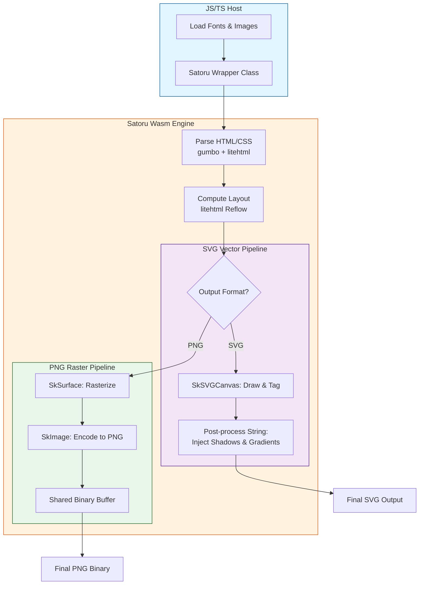

# Satoru Wasm: High-Performance HTML to SVG/PNG Engine

https://sorakumo001.github.io/satoru/

**Satoru** is a portable, WebAssembly-powered HTML rendering engine. It combines the **Skia Graphics Engine** and **litehtml** to provide high-quality, pixel-perfect SVG and PNG generation entirely within WebAssembly.

## 🚀 Project Status: High-Fidelity Rendering Ready

The engine supports full text layout with custom fonts, complex CSS styling, and efficient binary data transfer for both vector (SVG) and raster (PNG) outputs.

### Key Capabilities

- **Pure Wasm Pipeline**: Performs all layout and drawing operations inside Wasm. Zero dependencies on browser DOM or `<canvas>` for rendering.
- **Dual Output Modes**:
  - **SVG**: Generates lean, vector-based SVG strings with post-processed effects.
  - **PNG**: Generates high-quality raster images via Skia, transferred as binary data for maximum performance.
- **High-Level TS Wrapper**: Includes a `Satoru` class that abstracts Wasm memory management (`malloc`/`free`) and provides a clean async API.
- **Dynamic Font Loading**: Supports loading `.ttf` / `.woff2` / `.ttc` files at runtime.
- **Japanese Support**: Full support for Japanese rendering with fallback font logic.
- **Advanced CSS Support**:
  - **Box Model**: Margin, padding, border, and accurate **Border Radius**.
  - **Box Shadow**: High-quality shadows using SVG filters (SVG) or Skia blurs (PNG).
  - **Gradients**: Linear, Radial, and **Conic** (Sweep) gradient support.
  - **Text Decoration**: Supports `underline`, `line-through`, `overline` with `solid`, `dotted`, and `dashed` styles.
- **Efficient Image Handling**:
  - **Pre-loading Architecture**: The host registers image Data URLs into the Wasm image cache _before_ rendering.
  - **Host-side Decoding**: Image decoding is handled by the JavaScript environment, keeping the Wasm binary lean.
- **Cross-Platform Build System**: A unified TypeScript build script handles everything from CMake configuration to Emscripten compilation.

## 🔄 Conversion Flow

The following diagram illustrates how Satoru processes HTML/CSS into vector or raster outputs:



## 🛠 Usage (TypeScript)

```typescript
import { Satoru } from "@satoru/core";

const satoru = new Satoru();
await satoru.init();

// Load a font
const fontData = await fetch("font.ttf").then((res) => res.arrayBuffer());
satoru.loadFont(new Uint8Array(fontData));

// Convert HTML to SVG
const svg = satoru.toSvg("<h1>Hello World</h1>", { width: 800 });

// Convert HTML to PNG (Binary)
const pngBuffer = satoru.toPngBinary('<div style="...">...</div>', {
  width: 400,
});
// pngBuffer is a Uint8Array containing the PNG file data
```

## 🏗️ Project Structure

This project is organized as a monorepo using pnpm workspaces:

- **`packages/satoru` (`@satoru/core`)**: The core library. Contains the WebAssembly engine, Skia/litehtml integration, and the TypeScript wrapper.
- **`packages/test-web` (`@satoru/test-web`)**: A web-based development and demonstration UI built with Vite.
- **`src/cpp`**: Shared C++ source code for the Wasm engine.
- **`scripts`**: Build automation scripts.

## 🛠️ Build & Run

### Prerequisites

- [emsdk](https://github.com/emscripten-core/emsdk) (Targeting `latest`)
- [vcpkg](https://vcpkg.io/) (Wasm32-emscripten triplet)
- Node.js & pnpm

#### Environment Variables

- `EMSDK`: Path to your emscripten SDK directory.
- `VCPKG_ROOT`: Path to your vcpkg directory.

### Commands

```bash
# 1. Install dependencies
pnpm install

# 2. Configure WASM build (CMake)
pnpm wasm:configure

# 3. Build WASM artifacts (satoru.js / satoru.wasm)
pnpm wasm:build

# 4. Build TypeScript packages
pnpm build

# 5. Run tests (Convert assets to SVG/PNG in temp/)
pnpm test

# 6. Start development UI
pnpm dev
```

## 🗺️ Roadmap

- [x] High-level TypeScript Wrapper API.
- [x] Binary PNG export support.
- [x] Linear, Radial & Conic Gradient support.
- [x] Border Radius & Box Shadow.
- [x] Japanese Language Rendering.
- [x] Text Decoration Styles (Dotted/Dashed).
- [ ] SVG Path Shorthand Optimization.
- [ ] Support for CSS Masks & Filters.
- [ ] Optional SVG `<text>` element output.

## 📄 License

MIT License - SoraKumo <info@croud.jp>
