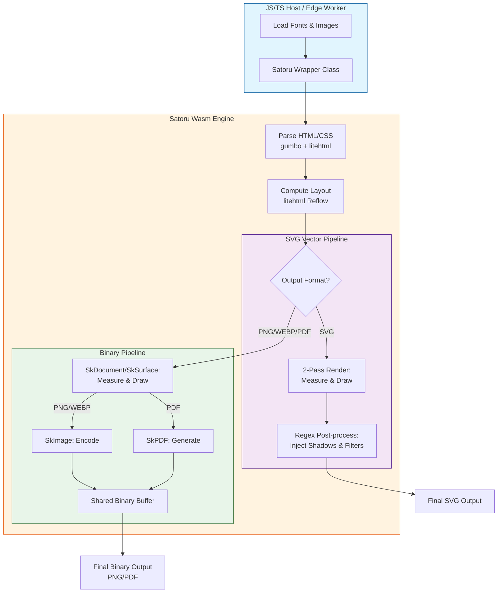

# Satoru Wasm: High-Performance HTML to SVG/PNG/PDF Engine

[](https://sorakumo001.github.io/satoru/)
[](https://www.npmjs.com/package/satoru-render)
[](https://www.npmjs.com/package/satoru-render)
[](https://www.npmjs.com/package/satoru-render)
[](https://deepwiki.com/SoraKumo001/satoru)

**Satoru** is a portable, WebAssembly-powered HTML rendering engine. It combines the **Skia Graphics Engine** and **litehtml** to provide high-quality, pixel-perfect SVG, PNG, and PDF generation entirely within WebAssembly.

---

## 📊 Satoru vs Satori

| Feature            | Satori (Vercel)                    | **Satoru**                                          |
| ------------------ | ---------------------------------- | --------------------------------------------------- |
| **Engine**         | Yoga (Flexbox only)                | **litehtml (Full CSS Layout)**                      |
| **Renderer**       | Custom SVG Generator               | **Skia Graphics Engine**                            |
| **Output Formats** | SVG                                | **SVG, PNG, WEBP, PDF**                             |
| **CSS Support**    | Limited subset (Flexbox)           | **Extensive (Floats, Box-shadow, etc.)**            |
| **Images**         | External URLs, Base64, ArrayBuffer | **Embedded/Local/Url (PNG, JPEG, WebP, AVIF, GIF)** |
| **Font Formats**   | TTF, OTF, WOFF                     | **TTF, OTF, WOFF2, TTC**                            |
| **Typography**     | SVG Paths / Fonts                  | **Full Skia Typeface support**                      |
| **Performance**    | High (Lightweight)                 | **High (Wasm-accelerated Skia)**                    |
| **Edge Ready**     | Yes (Node/Edge/Cloudflare)         | **Yes (Wasm/Edge/Cloudflare)**                      |

---

## 🔄 Conversion Flow

The following diagram illustrates how Satoru processes HTML/CSS into vector or raster outputs:


```mermaid
graph TD
    subgraph Host [JS/TS Host / Edge Worker]
        A[Load Fonts & Images] --> B[Satoru Wrapper Class]
    end

    subgraph WASM [Satoru Wasm Engine]
        B --> C[Parse HTML/CSS<br/>gumbo + litehtml]
        C --> D[Compute Layout<br/>litehtml Reflow]

        D --> E{Output Format?}

        subgraph SVG_Path [SVG Vector Pipeline]
            E -- SVG --> F[2-Pass Render:<br/>Measure & Draw]
            F --> G[Regex Post-process:<br/>Inject Shadows & Filters]
        end

        subgraph WASM_Raster_Path [Binary Pipeline]
            E -- PNG/WEBP/PDF --> H[SkDocument/SkSurface:<br/>Measure & Draw]
            H -- PNG/WEBP --> I[SkImage: Encode]
            H -- PDF --> J[SkPDF: Generate]
            I --> K[Shared Binary Buffer]
            J --> K
        end
    end

    G --> L[Final SVG Output]
    K --> M[Final Binary Output<br/>PNG/PDF]

    style Host fill:#e1f5fe,stroke:#01579b
    style WASM fill:#fff3e0,stroke:#e65100
    style SVG_Path fill:#f3e5f5,stroke:#4a148c
    style WASM_Raster_Path fill:#e8f5e9,stroke:#1b5e20
```

---

## 🚀 Key Capabilities

### Core Engine

- **Pure Wasm Pipeline**: Performs all layout and drawing operations inside Wasm. Zero dependencies on browser DOM or `<canvas>`.
- **Edge Native**: Optimized for **Cloudflare Workers (workerd)**, ensuring smooth execution in restricted environments.
- **Triple Output Modes**:
  - **SVG**: Lean, vector-based SVG strings with post-processed filters/gradients. Includes **Glyph Path Optimization** using `<defs>` and `<use>` to minimize file size when converting text to paths.
  - **Raster (PNG/WebP)**: High-quality images via Skia with hardware-accelerated encoding.
  - **PDF**: Vector documents via Skia's PDF backend, including **multi-page output**.
- **State Persistence**: Supports a **Layout-Once, Render-Anywhere** pattern. Serialize layout state to binary and restore it later to skip reflow.

### Typography & Resources

- **Modular Text Stack**: A structured text processing pipeline consisting of `UnicodeService` (encapsulation of utf8proc/libunibreak), `TextLayout` (measurement & shaping), and `TextRenderer` (Skia drawing & decorations).
- **International Text Support**: Robust BiDi handling, script detection, and line-breaking (UAX #14) for CJK and mixed-script text.
- **Performance-Optimized Typography**: Implements a **Shaping Cache** that stores HarfBuzz results and `SkTextBlob` objects, significantly reducing CPU overhead for recurring text/font combinations.
- **Dynamic & Automatic Font Loading**: Supports runtime loading of `.ttf`, `.woff2`, and `.ttc`. Missing fonts can be **automatically resolved via Google Fonts** using a customizable `fontMap`.
- **Image Format Support**: Native support for PNG, JPEG, WebP, AVIF, GIF, BMP, and ICO.

### Advanced CSS Support

- **Modern Color**: `oklch()`, `color-mix()`, and relative color syntax.
- **Layout**: `aspect-ratio`, Flexbox, Grid Layout (Basic), and **Container Queries**.
- **Effects**: Box-shadow (Outer/Inset), Text-shadow, Gradients (Linear/Radial/Conic), and CSS Filters (Blur, Drop-shadow).
- **Transforms**: Full support for `translate`, `rotate`, `scale`, `skew`, and `matrix` with correct stacking context.

---

## 📋 Supported CSS Properties

<details>
<summary>Click to expand supported properties list</summary>

### Box Model, Layout & Logical Properties

- `display` (block, inline, flex, grid, list-item, table, etc.)
- `position` (static, relative, absolute, fixed)
- `float`, `clear`, `visibility`, `z-index`, `overflow`, `box-sizing`, `aspect-ratio`
- `width`, `height`, `min-width`, `min-height`, `max-width`, `max-height`
- `margin`, `padding`, `border` (Width, Style, Color)
- **Logical Properties**: `inline-size`, `block-size`, `margin-inline`, `margin-block`, `padding-inline`, `padding-block`, `border-inline`, `border-block` (Start/End)

### Typography & Text

- `color`, `font-family`, `font-size`, `font-weight`, `font-style`, `line-height`
- `text-align`, `vertical-align`, `text-decoration` (Underline, Overline, Line-through, Wavy)
- `text-transform`, `text-indent`, `text-overflow` (Ellipsis), `white-space`, `line-clamp`
- `text-shadow`, `direction`, `writing-mode` (horizontal-tb, vertical-rl, vertical-lr)

### Backgrounds, Borders & Shadows

- `background` (Color, Image, Position, Size, Repeat, Clip, Origin)
- `border-radius`, `box-shadow` (Outer & Inset)
- `border-image` (Source, Slice, Width, Outset, Repeat)

### Flexbox & Grid

- `display: flex`, `flex-direction`, `flex-wrap`, `justify-content`, `align-items`, `align-content`, `align-self`, `flex-grow`, `flex-shrink`, `flex-basis`, `gap`, `order`
- `display: grid`, `grid-template-columns`, `grid-template-rows`, `grid-column`, `grid-row`, `gap`

### Effects, Shapes & Functions

- `clip-path` (circle, ellipse, inset, polygon, path)
- `filter`, `backdrop-filter`, `opacity`
- **Gradients**: `linear-gradient`, `radial-gradient`, `conic-gradient`
- **Modern Functions**: `calc()`, `min()`, `max()`, `clamp()`, `oklch()`, `oklab()`, `color-mix()`, `light-dark()`, `env()`, `var()`
- **Container Queries**: `@container`, `container-type`, `container-name`
- **Masking**: `mask`, `-webkit-mask`
- `content`, `appearance`

</details>

---

## 🛠️ Usage (TypeScript)

### 1. Standard Environment (Node.js / Browser)

Satoru provides a high-level `render` function that handles WASM instantiation and resource resolution.

```typescript
import { render, LogLevel } from "satoru-render";

const html = `
  <style>
    @font-face {
      font-family: 'Roboto';
      src: url('https://fonts.gstatic.com/s/roboto/v30/KFOmCnqEu92Fr1Mu4mxK.woff2');
    }
  </style>
  <div style="font-family: 'Roboto'; color: #2196F3; font-size: 40px;">
    Hello Satoru!
  </div>
`;

const png = await render({
  value: html,
  width: 600,
  format: "png",
  fontMap: {
    Roboto: "https://fonts.googleapis.com/css2?family=Roboto&display=swap",
  },
  resolveResource: async (r) => {
    const res = await fetch(r.url);
    return res.ok ? new Uint8Array(await res.arrayBuffer()) : null;
  },
});
```

### 2. Google Fonts Auto-Resolution

If a font is missing from your local environment or `@font-face` definitions, Satoru can automatically fetch it from Google Fonts using the `fontMap` option. By default, it maps generic families:

- `sans-serif` → Noto Sans JP
- `serif` → Noto Serif JP
- `monospace` → Noto Sans Mono
- `cursive` → Klee One
- `fantasy` → Mochiy Pop One

```typescript
// Uses default mappings (e.g. sans-serif becomes Noto Sans JP)
const svg = await render({
  value: '<div style="font-family: sans-serif;">Hello</div>',
  width: 600,
});
```

### 3. Cloudflare Workers (Edge)

Use the `workerd` specific export for restricted environments.

```typescript
import { render } from "satoru-render/workerd";
// ... use as normal
```

### 3. Multi-threaded Rendering

Distribute rendering tasks across multiple threads for high-throughput apps.

```typescript
import { createSatoruWorker } from "satoru-render";
const satoru = createSatoruWorker({ maxParallel: 4 });
const png = await satoru.render({ ...options });
```

### 4. Single-file (Embedded WASM)

Includes the WASM binary embedded in the JS bundle.

```typescript
import { render } from "satoru-render/single";
```

### 5. React Integration

```typescript
import { render } from "satoru-render";
import { toHtml } from "satoru-render/react";
const html = toHtml(<div style={{ color: "red" }}>React Component</div>);
const png = await render({ value: html, width: 600, format: "png" });
```

### 6. JSDOM Hydration (For Next.js / SPAs)

For complex client-side applications (like Next.js) that require full Javascript evaluation and DOM hydration before rendering, Satoru provides an optional `jsdom` helper. 

*Note: `jsdom` must be installed separately in your project (`npm install jsdom`).*

```typescript
import { render } from "satoru-render";
import { hydrateHtml } from "satoru-render/jsdom";

// 1. Let JSDOM fetch the URL, execute scripts, and wait for network/hydration
const hydratedHtml = await hydrateHtml({
  urlOrHtml: 'https://zenn.dev/',
  waitUntil: 'networkidle', // Wait until Next.js finishes loading chunks
  beforeParse: (window) => {
    // Provide polyfills if the target site requires them
    window.matchMedia = () => ({ matches: false, addListener: () => {} });
    window.IntersectionObserver = class { observe(){} unobserve(){} disconnect(){} };
  }
});

// 2. Render the fully constructed DOM in Satoru (at native speed)
const pngBytes = await render({
  value: hydratedHtml,
  baseUrl: 'https://zenn.dev/',
  width: 1200,
  format: 'png'
});
```

---

## 💻 CLI Usage

```bash
# Convert HTML file to PNG
npx satoru input.html -o output.png -w 1024

# Convert URL to PDF
npx satoru https://example.com -o example.pdf -f pdf
```

---

## 🏗️ Development

### Local Build

```bash
pnpm install
pnpm wasm:configure
pnpm wasm:build
pnpm build
```

### Testing

```bash
# Run visual regression tests
pnpm --filter visual-test test
```

---

## 📜 License

MIT License - SoraKumo <info@croud.jp>
