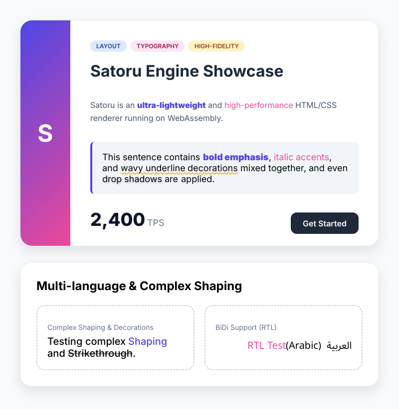

# Satoru Render: High-Performance HTML to Image/PDF Engine

[](https://sorakumo001.github.io/satoru/)
[](https://www.npmjs.com/package/satoru-render)
[](https://www.npmjs.com/package/satoru-render)
[](https://www.npmjs.com/package/satoru-render)
[](https://deepwiki.com/SoraKumo001/satoru)

**Satoru Render** is a high-fidelity HTML-to-Image/PDF conversion engine built with WebAssembly. It provides a lightweight, dependency-free solution for generating high-quality visuals and documents across **Node.js**, **Cloudflare Workers**, **Deno**, and **Web Browsers**.

By combining the **Skia** graphics engine with a custom **litehtml** layout core, Satoru performs all layout and drawing operations entirely within WASM, eliminating the need for headless browsers or system-level dependencies.



---

## ✨ Key Features

- **Pure WebAssembly Engine**: 100% independent of browser DOM or `<canvas>`. Runs anywhere WASM is supported.
- **Edge Native**: Specifically optimized for **Cloudflare Workers (workerd)** and other serverless environments.
- **Professional Graphics**:
  - **SVG**: Lean, vector-based strings with post-processed filters and gradients.
  - **PNG / WebP**: High-performance raster images with advanced Skia rendering.
  - **PDF**: Multi-page vector documents with native text and gradient support.
- **Advanced CSS Capabilities**:
  - **Box Model**: Precise margin, padding, borders, and **Border Radius**.
  - **Shadows**: High-quality **Outer** and **Inset** shadows (using SVG filters or Skia blurs).
  - **Gradients**: Linear, **Elliptical Radial**, and **Conic** (Sweep) support.
  - **Text Styling**: Multi-shadows, decorations (solid/dotted/dashed), and automatic weight/style inference.
- **Internationalization**: Robust support for complex text layouts, including **Japanese** and multi-font fallback logic.
- **Smart Resource Management**: Dynamic loading of `.ttf`, `.woff2`, and `.ttc` fonts, plus native support for all major image formats (AVIF, WebP, PNG, JPEG, etc.).

---

## 📦 Installation

```bash
npm install satoru-render
```

---

## 🚀 Quick Start

### Basic Usage (TypeScript)

The `render` function is the primary entry point. It handles WASM instantiation, resource resolution, and conversion in a single call.

```typescript
import { render } from "satoru-render";

const html = `
  <div style="padding: 40px; background: #f8f9fa; border-radius: 12px; border: 2px solid #dee2e6;">
    <h1 style="color: #007bff; font-family: sans-serif;">Hello Satoru!</h1>
    <p style="color: #495057;">This document was rendered entirely in WebAssembly.</p>
  </div>
`;

// Render to PNG
const png = await render({
  value: html,
  width: 600,
  format: "png",
});
```

---

## 🛠️ Advanced Usage

### 1. Dynamic Resource Resolution

Satoru can automatically fetch missing fonts, images, or external CSS via a `resolveResource` callback.

```typescript
const pdf = await render({
  value: html,
  width: 800,
  format: "pdf",
  baseUrl: "https://example.com/assets/",
  resolveResource: async (resource, defaultResolver) => {
    // Custom intercept logic
    if (resource.url.startsWith("my-app://")) {
      return myAssetBuffer;
    }
    // Fallback to default fetch/filesystem resolver
    return defaultResolver(resource);
  },
});
```

### 2. Multi-page PDF Generation

Generate complex documents by passing an array of HTML strings. Each element in the array becomes a new page.

```typescript
const pdf = await render({
  value: ["<h1>Page One</h1>", "<h1>Page Two</h1>", "<h1>Page Three</h1>"],
  width: 595, // A4 width in points
  format: "pdf",
});
```

### 3. Edge/Cloudflare Workers

Use the specialized `workerd` export for serverless environments.

```typescript
import { render } from "satoru-render";

export default {
  async fetch(request) {
    const png = await render({
      value: "<h1>Edge Generated Image</h1>",
      width: 800,
      format: "png",
    });

    return new Response(png, { headers: { "Content-Type": "image/png" } });
  },
};
```

### 6. Multi-threaded Rendering (Worker Proxy)

Distribute rendering tasks across multiple background workers for high-throughput applications.

```typescript
import { createSatoruWorker } from "satoru-render/workers";

const satoru = createSatoruWorker({ maxParallel: 4 });

const png = await satoru.render({
  value: "<h1>Parallel Task</h1>",
  width: 800,
  format: "png",
});
```

---

## 💻 CLI Tool

Convert files or URLs directly from your terminal.

```bash
# Local HTML to PNG
npx satoru-render input.html -o output.png

# URL to PDF with specific width
npx satoru-render https://example.com -o site.pdf -w 1280

# WebP conversion with verbose logs
npx satoru-render input.html -f webp --verbose
```

---

## 📖 API Reference

### Render Options

| Option            | Type                                | Description                                             |
| :---------------- | :---------------------------------- | :------------------------------------------------------ |
| `value`           | `string \| string[]`                | HTML string or array of strings (for multi-page PDF).   |
| `url`             | `string`                            | URL to fetch HTML from.                                 |
| `width`           | `number`                            | **Required.** Output width in pixels.                   |
| `height`          | `number`                            | Output height. Default: `0` (auto-calculate).           |
| `format`          | `"svg" \| "png" \| "webp" \| "pdf"` | Output format. Default: `"svg"`.                        |
| `resolveResource` | `ResourceResolver`                  | Async callback to fetch assets (fonts, images, CSS).    |
| `fonts`           | `Object[]`                          | Pre-load fonts: `[{ name, data: Uint8Array }]`.         |
| `css`             | `string`                            | Extra CSS to inject into the document.                  |
| `baseUrl`         | `string`                            | Base URL for relative path resolution.                  |
| `logLevel`        | `LogLevel`                          | Verbosity: `None`, `Error`, `Warning`, `Info`, `Debug`. |

---

## 📜 License

This project is licensed under the **MIT License**.
